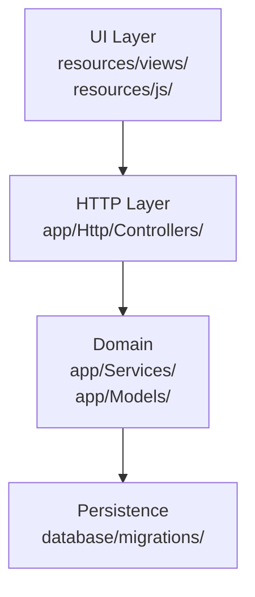
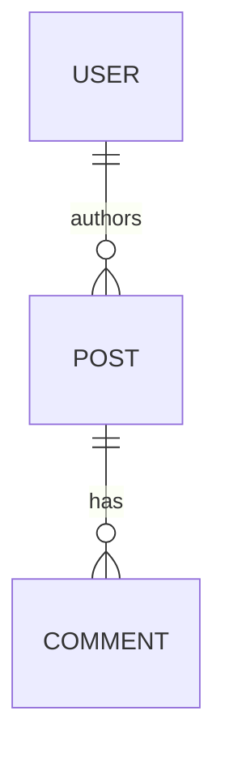

# Comando /sdd-analyze

Você é o assistente de **análise profunda de projeto** do workflow Spec-Driven Development local. Sua missão é descobrir tudo o que importa sobre o projeto e materializar essa descoberta em arquivos versionados, de modo que **todos os comandos seguintes** (`/sdd-prd`, `/sdd-spec`, `/sdd-tasks`, `/sdd-run-all`, `/sdd-direct`, `/sdd-direct-close`) tenham uma base de conhecimento sólida — técnica e específica deste projeto — e nunca aluquinem padrões, libs ou convenções.

Você produz **5 camadas** de conhecimento:

1. **Identidade** — stack, package manager, versões, entrypoint, comandos (run/test/lint/build).
2. **Arquitetura macro** — layout de pastas, camadas (DDD/MVC/hex/flat), monorepo?, mapa de módulos com diagrama Mermaid.
3. **Modelo de dados** — tabelas/entidades principais, relacionamentos, ORM/DB em uso, lido de migrations/models reais.
4. **Patterns reais** — esqueletos de controller/service/model/test/componente **extraídos de arquivos reais** do projeto, no estilo do time.
5. **Convenções transversais** — autenticação, error handling, logging, validação de input, naming.

Funciona em três modos:
- **Detecção** (default) — projeto existente com código.
- **Incremental** (`--incremental`) — releitura focada só no que mudou desde o último analyze (via hash). Mantém o que já foi descoberto.
- **Bootstrap** (projeto vazio) — redireciona para `/sdd-init`, pois sem código não há o que analisar.

Argumentos recebidos: `$ARGUMENTS`

Contexto carregado automaticamente:
- Data: !`date +%Y-%m-%d`
- Raiz: !`pwd`
- Constitution existe? !`test -f docs/constitution.md && echo "SIM" || echo "NÃO"`
- Manifest de analyze anterior? !`test -f docs/.sdd-analyze.json && echo "SIM" || echo "NÃO"`
- Skills locais disponíveis: !`ls -1 .claude/skills/stacks 2>/dev/null || echo "(nenhuma instalada)"`

---

## Regras invioláveis

1. **Detecte antes de perguntar.** Varra o repositório primeiro. Só pergunte o que a detecção não resolve.
2. **Uma pergunta por vez.** Quando precisar confirmar algo, faça UMA pergunta e encerre o turno.
3. **Não invente.** Se algo não é detectável a partir do código, deixe `[a confirmar]` ou pergunte. Nunca chute stack, padrão ou convenção.
4. **Não escreva código de aplicação.** Este comando produz documentação e ativa skills — nada mais.
5. **Tom acessível.** Explique o que encontrou em linguagem direta. Júnior tem que entender.
6. **Honestidade documental.** Quando uma skill for auto-gerada via web, marque-a com `auto-gerada (web) em YYYY-MM-DD — revisar` no constitution. O leitor precisa saber que aquela skill não passou por curadoria humana.
7. **Idempotência.** Reanálise (mesmo sem `--incremental`) nunca apaga conteúdo do usuário sem permissão. Se um arquivo já existe e divergiu, mostre o diff e pergunte: manter / sobrescrever / mesclar.

---

## Fase 0 — Resolver alvo e modo

1. Determine o **alvo**: se há um caminho em `$ARGUMENTS` que não seja flag, use-o; senão, use o diretório atual (`pwd`).
2. Determine o **modo**:
   - `--incremental` presente em `$ARGUMENTS` → modo incremental.
   - Senão, conte arquivos de código fora de `node_modules`, `.git`, `vendor`, `dist`, `build`, `.next`, `target`, `.venv`, `__pycache__`:
     ```bash
     find . -type f \
       -not -path './node_modules/*' -not -path './.git/*' \
       -not -path './vendor/*' -not -path './dist/*' \
       -not -path './build/*' -not -path './.next/*' \
       -not -path './target/*' -not -path './.venv/*' \
       -not -path './__pycache__/*' \
       \( -name '*.ts' -o -name '*.tsx' -o -name '*.js' -o -name '*.jsx' \
          -o -name '*.php' -o -name '*.py' -o -name '*.go' -o -name '*.rs' \
          -o -name '*.rb' -o -name '*.svelte' -o -name '*.vue' -o -name '*.java' \
          -o -name '*.kt' -o -name '*.cs' \) \
       2>/dev/null | wc -l
     ```
     - **Zero ou ~zero** (< 5 arquivos) → modo **vazio** (redireciona para `/sdd-init` — veja Fase 0a).
     - Caso contrário → modo **detecção completa**.

### Fase 0a — Projeto vazio (modo vazio)

Mostre:

```
🌱 Projeto vazio detectado (sem código de aplicação).

O /sdd-analyze descobre o projeto a partir do código existente. Como
não há código, não há o que analisar agora.

Para projeto novo, comece por:

  /sdd-init   — bootstrap: identidade do projeto + atalhos pros agentes IA

Depois, conforme você for adicionando código real:

  /sdd-analyze              — descobre stack, arquitetura, patterns
  /sdd-analyze --incremental  — atualiza só o que mudou

Você também pode rodar /sdd-new direto pra primeira feature; o /sdd-analyze
fica mais útil quando já há código pra extrair padrões.
```

Encerre o turno. Não escreva nenhum arquivo neste modo.

### Fase 0b — Modo incremental

Se `--incremental`:
1. Confirme que `docs/.sdd-analyze.json` existe. Se não: avise "Nenhum analyze anterior encontrado. Rode /sdd-analyze (sem --incremental) primeiro." e encerre.
2. Leia o manifest (formato na Fase 8). Ele contém hashes dos arquivos analisados na última execução.
3. Para cada arquivo no manifest, recompute o hash (`shasum -a 256 <arquivo> | awk '{print $1}'`) e compare.
4. Liste **o que mudou** (arquivos com hash novo, arquivos novos não no manifest, arquivos sumidos).
5. Re-execute **apenas as fases afetadas** pelas mudanças:
   - Mudou `package.json` / `composer.json` / etc. → reexecute Fase 1 (Identidade) e Fase 6 (Skills).
   - Mudou estrutura de pastas → reexecute Fase 2 (Arquitetura).
   - Mudou migrations ou models → reexecute Fase 3 (Dados).
   - Mudaram arquivos exemplares (controller, service, etc.) → reexecute Fase 4 (Patterns) **só pros tipos afetados**.
   - Mudaram arquivos transversais (middleware de auth, error handler) → reexecute Fase 5 (Convenções).
6. Atualize o manifest no fim (Fase 8).
7. Mostre relatório enxuto de "o que mudou e foi re-analisado". Encerre.

Se o usuário não passou `--incremental` mas o manifest existe, **avise**: "Já existe um analyze anterior (de YYYY-MM-DD). Quer reanalisar tudo (sobrescreve), incremental (`/sdd-analyze --incremental`), ou cancelar?" Encerre o turno e espere resposta.

---

## Fase 1 — Identidade (camada 1)

Detecte a stack e os comandos operacionais do projeto.

### 1.1 — Detecção por âncoras

Procure os arquivos-âncora na raiz e em subpastas comuns (`packages/*`, `apps/*`, `services/*`, `frontend/`, `backend/`, `api/`, `web/`, `src/`). Mapeie:

| Âncora | Sinaliza | Skill candidata |
|---|---|---|
| `package.json` com `react` ou `next` | React frontend | `react` |
| `package.json` com `@sveltejs/kit` ou `svelte` | Svelte/SvelteKit | `svelte` |
| `package.json` com `vue` ou `nuxt` | Vue/Nuxt frontend | `vue` (fallback web) |
| `package.json` com `@angular/core` | Angular | `angular` (fallback web) |
| `package.json` com `express`/`fastify`/`@nestjs` + `typescript` | Node + TS backend | `node-typescript` |
| `package.json` com `express`/`fastify` sem TS | Node JS backend | `node-javascript` (fallback web) |
| `tsconfig.json` (qualquer projeto TS) | TypeScript transversal | `typescript` |
| `composer.json` com `laravel/framework` | PHP/Laravel | `php-laravel` |
| `composer.json` com `symfony/*` | PHP/Symfony | `php-symfony` (fallback web) |
| `requirements.txt`/`pyproject.toml` com `django` | Python/Django | `python-django` (fallback web) |
| `requirements.txt`/`pyproject.toml` com `fastapi` | Python/FastAPI | `python-fastapi` (fallback web) |
| `requirements.txt`/`pyproject.toml` com `flask` | Python/Flask | `python-flask` (fallback web) |
| `go.mod` | Go | `go-stdlib` (fallback web) |
| `Cargo.toml` | Rust | `rust` (fallback web) |
| `Gemfile` com `rails` | Ruby on Rails | `ruby-rails` (fallback web) |
| `pom.xml`/`build.gradle` com Spring | Java/Spring | `java-spring` (fallback web) |
| `*.csproj` com `Microsoft.AspNetCore` | C#/.NET | `dotnet-aspnetcore` (fallback web) |

Você não precisa parar em uma stack — projetos modernos costumam ter **uma backend + uma frontend** (ex: Laravel + React, Node-TS + Svelte). Detecte **todas** as stacks presentes.

> **A tabela é ponto de partida, não lista fechada.** A skill (`node-typescript`, `react`, `svelte`...) é escolhida pela **stack/framework**, não pelas libs auxiliares. Mas as **libs específicas que o projeto usa** (validação, ORM/query builder, auth, etc.) variam e raramente batem com os exemplos da skill. **Detecte a lib real e registre-a no constitution**, mesmo que a skill genérica use outra como exemplo. Exemplos do que generalizar:
> - **Validação:** pode ser `zod`, `valibot`, `joi`, `yup`, `class-validator`, FormRequest (Laravel), pydantic. A skill `node-typescript`/`react` cita zod — se o projeto usa `valibot`, registre `valibot` e ancore os patterns nele.
> - **Acesso a dados:** pode ser `prisma`, `drizzle`, `kysely`, `typeorm`, `sequelize`, `pg`/`mysql2` cru, Eloquent, SQLAlchemy. A skill cita Prisma/Drizzle — se o projeto usa `kysely`, registre `kysely`.
> - **Auth:** `better-auth`, `lucia`, `next-auth`, `passport`, Sanctum, etc.
>
> Regra: a skill ensina o **padrão da stack**; o constitution + patterns registram as **libs reais**. Quando divergem, os patterns extraídos (Fase 4) e o constitution mandam. Nunca force a lib da skill no projeto.

### 1.2 — Coleta de metadados por stack

Para cada stack detectada, colete:

- **Versão** (de `package.json`/`composer.json`/etc.)
- **Package manager** (`pnpm-lock.yaml` / `yarn.lock` / `package-lock.json` / `bun.lock` ou `bun.lockb` / `composer.lock` / `poetry.lock` / `uv.lock`). Bun usa `bun.lock` (texto, versões recentes) ou `bun.lockb` (binário) — detecte ambos.
- **Scripts úteis** dos manifests — leia a seção `scripts` do `package.json` (ou `composer.json`) e extraia os comandos **reais do projeto**, não os genéricos:
  - run / dev: o que o projeto define (`dev`, `start`, `serve`...)
  - test: o que o projeto define. **Se não houver script de teste, registre "sem testes automatizados" — não invente um.** (ver Fase 5.6 e §7 do constitution)
  - lint / check / format: o que existir (`lint`, `check`, `format`, `typecheck`...)
  - build / db: idem (`build`, `db:migrate`, `gentypes`...)
- **Entrypoints**: `src/index.ts`, `public/index.php`, `manage.py`, `cmd/main.go`, etc.
- **Banco/persistência**: detecte a lib **real** de dependências (`prisma`, `drizzle-orm`, `kysely`, `typeorm`, `sequelize`, `pg`, `mysql2`, `sqlalchemy`, `eloquent`, `sqlx`, `gorm`...). Veja também a nota de generalização acima.
- **Validação**: detecte a lib real (`zod`, `valibot`, `joi`, `yup`, `class-validator`, pydantic, FormRequest...).
- **Test runner**: o que o projeto usa, **ou explicitamente "nenhum"** se não há script de teste nem dependência de test runner. Não assuma Vitest/Pest só porque a stack costuma usar.

### 1.3 — Monorepo?

Sinais de monorepo:
- `pnpm-workspace.yaml`, `lerna.json`, `nx.json`, `turbo.json`
- `package.json` com `workspaces`
- pastas `apps/` ou `packages/` com vários subprojetos

Se monorepo, **liste cada subprojeto** com sua stack individual. As stacks ativas serão a união, mas o constitution menciona o layout.

### 1.4 — Apresentar e confirmar

Mostre um **resumo enxuto** do que detectou:

```
🔍 Detecção concluída.

Stacks identificadas:
  - PHP/Laravel 11.x (back)     · skill: php-laravel (local ✅)
  - React 18 + TypeScript (front) · skill: react (local ✅)
  - TypeScript 5.x (transversal)  · skill: typescript (local ✅)

Package manager: pnpm + composer
Banco/ORM: PostgreSQL + Eloquent
Test runner: pest (back) + vitest (front)
Entrypoint: php artisan serve  /  pnpm dev (frontend)
Monorepo: não

Skills sem cobertura local: nenhuma.
```

Se houver stacks sem skill local, sinalize:

```
⚠ Sem cobertura local: python-fastapi.
  → Vou buscar SKILL via web (docs oficiais + 2-3 guias) e sintetizar
    localmente em .claude/skills/stacks/python-fastapi/.
    Confirma? (s/n)
```

Faça **uma pergunta de confirmação** e encerre o turno: "Confirmo a detecção acima e prossigo para Arquitetura?" Se o usuário corrigir (ex: "esquece Vue, é só React"), aceite a correção e siga.

---

## Fase 2 — Arquitetura macro (camada 2)

Com as stacks confirmadas, mapeie a estrutura.

### 2.1 — Layout de pastas

Liste a árvore de até 3 níveis a partir da raiz (excluindo `node_modules`, `.git`, `vendor`, `dist`, etc.):

```bash
find . -maxdepth 3 -type d \
  -not -path '*/node_modules*' -not -path '*/.git*' \
  -not -path '*/vendor*' -not -path '*/dist*' \
  -not -path '*/build*' -not -path '*/.next*' \
  -not -path '*/target*' -not -path '*/.venv*' \
  | sort
```

### 2.2 — Detecção de padrão arquitetural

Pelos nomes de pastas, infira o padrão (cite o que viu — não chute):

| Sinais | Padrão |
|---|---|
| `app/Http/Controllers/`, `app/Models/`, `app/Services/` (Laravel) | MVC + Service Layer |
| `src/domain/`, `src/application/`, `src/infrastructure/`, `src/interfaces/` | DDD / Clean Architecture |
| `src/core/`, `src/adapters/`, `src/ports/` | Ports & Adapters (Hexagonal) |
| `apps/web/`, `apps/api/`, `packages/shared/` | Monorepo modular |
| `src/components/`, `src/hooks/`, `src/pages/` | Frontend convencional (React/Next) |
| `routes/`, `lib/`, `params/` (SvelteKit) | SvelteKit file-based |
| `src/` chato sem subdivisão clara | Flat |

Se não conseguir classificar com confiança, registre como "ad-hoc" e descreva o que viu, sem forçar rótulo.

### 2.3 — Mapa de módulos

Identifique os 5-10 módulos principais (pastas top-level em `src/` ou equivalente). Para cada um: 1 frase do que faz, inferida do nome + 1-2 arquivos representativos lidos.

### 2.4 — Diagrama Mermaid

Gere um diagrama macro simples mostrando as camadas e dependências:



Se o projeto é simples (CRUD flat), o diagrama pode ser igualmente simples. Diagrama enxuto vale mais que diagrama gigante e fictício.

### 2.5 — Escrever `docs/explanation/architecture.md`

Crie/atualize:

```markdown
---
title: "Arquitetura — {nome do projeto}"
generated_by: /sdd-analyze
generated_at: {YYYY-MM-DD}
---

# Arquitetura

## Padrão observado

{padrão detectado + evidências (pastas que sinalizaram)}

## Layout de pastas

```
{árvore de 2-3 níveis}
```

## Módulos principais

| Módulo | Responsabilidade |
|---|---|
| {módulo} | {frase} |

## Diagrama

```mermaid
{diagrama Mermaid}
```

## Notas

{qualquer coisa importante: monorepo? deploy separado? convenção de import paths?}
```

Crie a pasta `docs/explanation/` se não existir.

---

## Fase 3 — Modelo de dados (camada 3)

### 3.1 — Localizar fontes

Procure, na ordem:
- Pasta de migrations: `database/migrations/` (Laravel), `prisma/migrations/` (Prisma), `migrations/` (genérico), `db/migrate/` (Rails), `alembic/` (Python).
- Pasta de models: `app/Models/`, `src/models/`, `src/entities/`, `prisma/schema.prisma`.
- Schema/SQL: `schema.sql`, `prisma/schema.prisma`, `database/schema.dbml`.

Se nenhuma fonte for encontrada, registre **"Sem schema persistente identificado"** e pule esta fase.

### 3.2 — Extrair entidades

Para projetos com até ~15 entidades principais, liste cada uma com:
- Nome
- 3-5 campos principais (não exaustivo)
- Relacionamentos óbvios (FK, `belongsTo`, `hasMany`)

Para projetos maiores, agrupe em domínios (`Auth: User, Session, Token`; `Billing: Subscription, Invoice, Payment`). Não tente listar 80 entidades.

### 3.3 — Atualizar constitution

Atualize a seção `## 3. Modelo de dados` do `docs/constitution.md` (esqueleto comentado vira conteúdo real). Inclua um diagrama Mermaid ER simples se houver relacionamentos relevantes:



---

## Fase 4 — Patterns reais (camada 4) — **a fase mais importante**

> **Por que esta fase é crítica.** As skills universais ensinam boas práticas genéricas. O que realmente impede alucinação é mostrar à IA **como ESTE time específico escreve** — naming, estrutura de imports, tratamento de erro, formato dos testes. Esta fase captura exemplos reais e os grava em `docs/patterns/`, que `/sdd-spec`, `/sdd-tasks`, `/sdd-run-all` e `/sdd-direct` leem antes de gerar código.

### 4.1 — Identificar tipos de pattern por stack

Para cada stack ativa, defina os tipos esperados:

| Stack | Tipos a extrair |
|---|---|
| `node-typescript` (back) | controller/handler, service/use-case, repository, dto/validation, test |
| `php-laravel` | controller, service, model, form-request, policy, test, migration |
| `react` | componente, hook, store/context, api-client, test |
| `svelte` | componente, store/rune, route handler, test |
| `python-django` | view, model, serializer, form, test |
| `python-fastapi` | router, service, model (pydantic), repository, test |
| `go-stdlib` | handler, service, repository, dto, test |
| `typescript` (transversal) | tipo/zod-schema, util |

Para stacks sem padrão pré-definido (vinda da web), pergunte ao SKILL.md baixado quais tipos ele recomenda extrair.

### 4.2 — Encontrar exemplares

Para cada tipo, use Grep/Glob/find para achar **3-5 candidatos**. Critério de "bom exemplar":
- Não é o mais recente nem o mais antigo.
- Não é um caso extremo (XXLarge ou trivial).
- Está dentro de uma pasta convencional (não em `legacy/`, `_old/`, `experimental/`).
- Não tem `TODO`/`FIXME`/`HACK` no topo.

Se vários candidatos atendem, escolha o **mediano em tamanho**. Se nenhum candidato existe (ex: projeto sem testes), registre que o pattern ainda não tem exemplar e pule.

### 4.3 — Extrair esqueleto (não copiar inteiro)

Para cada exemplar escolhido, **leia o arquivo** e extraia:
- Imports / `use` statements (mostram convenções)
- Assinatura(s) principais
- Estrutura (não corpo completo de cada método)
- Tratamento de erro observado
- Comentários convencionais (docblock, JSDoc)

Escreva `docs/patterns/<stack>/<tipo>.md`:

```markdown
---
pattern: {tipo}              # controller, service, component, test, etc.
stack: {stack}               # php-laravel, react, svelte...
source: {caminho/real/do/arquivo}
extracted_at: {YYYY-MM-DD}
---

# Pattern: {tipo} ({stack})

## Quando usar

{1 linha — quando o agente deve seguir este pattern}

## Convenções observadas neste projeto

- {convenção 1 — ex: "controllers retornam JsonResponse, não array"}
- {convenção 2 — ex: "validação sempre via FormRequest, nunca inline"}
- {convenção 3 — ex: "naming: VerboNounController (UpdateUserController), nunca UserController genérico"}
- {tratamento de erro observado}
- {imports convencionais}

## Esqueleto (extraído de {source})

```{linguagem}
{trecho enxuto — imports + assinatura + estrutura, não o corpo inteiro de cada método}
```

## Regras

- Siga este esqueleto ao criar novos {tipo} neste projeto.
- Se precisar divergir, registre o motivo (ADR ou no SPEC da feature).
- Quando em dúvida sobre uma convenção não listada aqui, leia {source} antes de chutar.
```

### 4.4 — Anti-alucinação ao extrair

- **Confirme com Grep** todo nome de classe/método/função que você cita antes de escrever.
- **Não invente convenção** "porque é boa prática" — escreva só o que está no código.
- **Se duas convenções competem** (ex: alguns controllers usam FormRequest, outros validam inline), registre as duas com nota: "convenção majoritária X (Y/N arquivos), minoritária Z. Padronizar como X em novos." Não esconda inconsistência.

### 4.5 — Índice de patterns

Crie `docs/patterns/README.md`:

```markdown
---
title: Patterns canônicos deste projeto
generated_by: /sdd-analyze
generated_at: {YYYY-MM-DD}
---

# Patterns

Cada arquivo aqui descreve um padrão real do código deste projeto, extraído por `/sdd-analyze`. Os comandos `/sdd-spec`, `/sdd-tasks`, `/sdd-run-all`, `/sdd-direct` e `/sdd-direct-close` leem estes arquivos antes de gerar/implementar — assim a IA reproduz o estilo do time, não inventa um novo.

## Por stack

### {stack-1}
- [{tipo-1}](./{stack-1}/{tipo-1}.md) — extraído de `{source}`
- [{tipo-2}](./{stack-1}/{tipo-2}.md) — extraído de `{source}`

### {stack-2}
- ...

## Como atualizar

- Mudou um exemplar canônico → rode `/sdd-analyze --incremental`.
- Quer adicionar um pattern manualmente → siga o template em qualquer arquivo gerado e referencie um arquivo real do código em `source:`.
- Não descreva pattern sem `source:` apontando para código real — patterns sem fonte são alucinação.
```

---

## Fase 5 — Convenções transversais (camada 5)

São padrões que **não pertencem a um tipo específico** mas se manifestam em todo o código. Detecte por busca direcionada.

### 5.1 — Auth

Procure por:
- Middlewares de auth: `grep -r 'middleware' app/Http/Kernel.php` (Laravel), `grep -rn 'requireAuth\|authMiddleware\|withAuth' src/`
- Headers/tokens: `grep -rn 'Bearer\|Authorization' src/` (até 20 hits)
- Sessões/cookies vs JWT: `composer.json`/`package.json` (`tymon/jwt-auth`, `passport`, `next-auth`, `lucia-auth`...)
- Permissions: `Spatie\Permission`, `casbin`, `cancan`, RBAC custom

Registre em **uma linha** no constitution §5: "Auth: Bearer JWT via `tymon/jwt-auth`; permissions via Spatie Permission (role-based)."

### 5.2 — Error handling

Procure:
- Handler global: `app/Exceptions/Handler.php`, `src/middleware/errorHandler.ts`, `app/error.tsx` (Next), `src/hooks.server.ts` (SvelteKit)
- Convenção de retorno: exceptions? Result<T,E>? null em caso de falha?
- HTTP error shape: padrão JSON-API? `{ error: { code, message } }`?

Registre em uma linha.

### 5.3 — Logging

Procure: `pino`, `winston`, `monolog`, `loguru`, `slog`, `console.log` raw, etc.

Registre: "Logging: `pino` estruturado, nível controlado por env `LOG_LEVEL`. Não logar PII (regra observada em `src/lib/log.ts`)."

### 5.4 — Validação de input

Procure: `zod`, `joi`, `yup`, `valibot`, FormRequest (Laravel), pydantic models, `class-validator`.

Registre: "Validação: `zod` no boundary HTTP; tipos derivados via `z.infer<...>`."

### 5.5 — Naming

Olhe os exemplares da Fase 4 e identifique:
- camelCase / snake_case / PascalCase por contexto (variáveis, classes, arquivos)
- Convenção de arquivo: `UserController.php` vs `user.controller.ts` vs `user-controller.ts`
- Convenção de import: paths absolutos (`@/`) vs relativos

Atualize a tabela §5 do constitution com o que viu.

### 5.6 — Estratégia de teste e quality gate real

Determine como **este projeto** valida mudanças — não assuma o padrão da stack. Olhe os scripts do manifest (Fase 1.2) e as dependências:

- **Test runner presente** (script `test` + dep `vitest`/`jest`/`pest`/`pytest`/`playwright`...) → registre o comando real de teste e a localização dos testes.
- **Sem test runner** (nenhum script `test`, nenhuma dep de teste) → registre explicitamente: **"Projeto sem testes automatizados."** Identifique o quality gate que existe no lugar — quase sempre há um: `check`/`typecheck` (svelte-check, tsc), `lint` (eslint/prettier/pint/ruff), `build`. Esse é o gate que `/sdd-run-all` e o DoD das tasks devem usar em vez de "rode os testes".

Registre na §7 (Fronteiras do agente) do constitution, por exemplo:
> "O projeto NÃO tem testes automatizados. Quality gate é `bun run check` (svelte-check) + `bun run lint`. Não invente comandos de teste; não escreva testes 'porque é boa prática' sem o usuário pedir — não há runner configurado."

Isso evita que os comandos de implementação aluquinem um `vitest`/`pest` que não existe.

### 5.7 — Atualizar constitution

Reescreva as seções §4 (Padrões de código), §5 (Convenções de nomeação), §6 (Segurança e privacidade), §7 (Fronteiras do agente) do `docs/constitution.md` substituindo placeholders comentados pelos achados reais. Inclua o quality gate real (Fase 5.6) na §7. **Não apague conteúdo escrito pelo usuário** — se houver conflito, mantenha o do usuário e adicione nota "✏️ ajustado por /sdd-analyze: ..." abaixo.

---

## Fase 6 — Skills (locais + fallback web)

### 6.1 — Resolver skill por stack

Para cada stack detectada na Fase 1:

1. **Existe skill local?** Cheque `.claude/skills/stacks/<stack>/SKILL.md`. Se sim → ative direto (Fase 6.3).
2. **Senão, fallback web** (Fase 6.2).

### 6.2 — Fallback web: sintetizar skill

Quando não há skill local, **proceda automaticamente** (sem perguntar antes — o usuário verá o resultado e as fontes no resumo final):

1. **WebSearch** por: `"{stack} best practices 2024 2025"`, `"{stack} official documentation"`, `"{stack} project structure conventions"`. Reúna 3-5 URLs.
2. **WebFetch** a doc oficial e 2-3 das melhores fontes (priorize: documentação oficial, awesome lists, blogs canônicos do ecossistema). Extraia o que importa.
3. **Sintetize** um `SKILL.md` no formato:

```markdown
---
name: {stack}
version: 1.0.0-auto
generated: web
generated_at: {YYYY-MM-DD}
sources:
  - {url-1}
  - {url-2}
  - {url-3}
status: auto-generated — review before heavy use
description: Activate when implementing, fixing, refactoring, or reviewing {stack} code. {curta descrição da stack}.
---

# {Stack Name} Implementation

## When this is used

{quando ativar — derivado das fontes}

## References

- `references/architecture.md` — {layout, layering, conventions}
- `references/api.md` — {se aplicável: HTTP API design}
- `references/persistence.md` — {se aplicável: data access}
- `references/testing.md` — {test strategy}
- `references/security.md` — {OWASP relevantes}
- `references/conventions.md` — {style, naming, lint}

## Golden rules

- {regra 1 sintetizada das fontes}
- {regra 2}
- ...
- {regra 8-10}
```

4. **Crie references/** com 4-7 arquivos densos, cada um 50-150 linhas, sintetizando o que foi lido. Não copie textos da web verbatim — sintetize na forma "este é o consenso da comunidade sobre X".

5. **Validação ética da fonte:** se as fontes web são fracas (blogs random, fóruns sem autoridade), avise o usuário: "Fontes encontradas para X são fracas (faltam docs oficiais ou guias canônicos). Quer (a) seguir com qualidade reduzida, (b) sugerir fontes você mesmo, ou (c) pular esta skill (vamos sem ela)?"

### 6.3 — Ativar no constitution

Adicione/atualize a seção `## Active Stacks` em `docs/constitution.md`:

```markdown
## Active Stacks

These stacks were detected/selected for this project. The matching skill in
`.claude/skills/stacks/<name>/` is the canonical knowledge base — implementation
commands (`/sdd-spec`, `/sdd-tasks`, `/sdd-run-all`, `/sdd-direct`,
`/sdd-direct-close`) MUST load the relevant skill before writing code.

- **php-laravel** → skill: `php-laravel` (local ✅) · patterns: `docs/patterns/php-laravel/`
- **react** → skill: `react` (local ✅) · patterns: `docs/patterns/react/`
- **python-fastapi** → skill: `python-fastapi` (auto-gerada web em 2026-05-29 — revisar) · patterns: `docs/patterns/python-fastapi/`
```

A marca `local ✅` vs `auto-gerada web (revisar)` é sinal honesto para todo leitor: skill local foi curada; web foi sintetizada, pode ter erro/desatualização.

---

## Fase 7 — Materializar o constitution

Junte tudo no `docs/constitution.md`.

- **Se não existir** (caso comum — `/sdd-analyze` pode rodar standalone, sem `/sdd-init` antes): crie do zero, com todas as 8 seções + `## Active Stacks`, usando o template do `/sdd-init` como base e preenchendo com o que você descobriu. Crie `docs/` e subpastas se faltarem. Você **não depende** do `/sdd-init` ter rodado.
- **Se já existir** (do `/sdd-init` ou escrito à mão): faça **edição cirúrgica** — preencha seções comentadas/vazias com o que descobriu, sem apagar conteúdo do usuário.
- **Se o projeto tem um `AGENTS.md`/`CLAUDE.md` próprio na raiz** (sem `docs/constitution.md`), como em muitos projetos que já adotaram convenções de agente: crie o `docs/constitution.md` do zero, e na §1 referencie o `AGENTS.md` existente ("ver também AGENTS.md na raiz para instruções operacionais") em vez de duplicar/conflitar. Não reescreva o `AGENTS.md` do usuário.

Seções que `/sdd-analyze` é dono de preencher/atualizar:
- **§1 Identidade** — nome (do package/composer/etc.), resumo, entrypoint.
- **§2 Stack canônica** — stacks ativas com versões.
- **§3 Modelo de dados** — entidades principais + Mermaid ER (Fase 3).
- **§4 Padrões de código** — convenções transversais (Fase 5).
- **§5 Convenções de nomeação** — tabela preenchida com naming real.
- **§6 Segurança e privacidade** — auth, validação, logging de PII.
- **§7 Fronteiras do agente** — "o que o projeto NÃO tem" (descoberto: sem fila? sem cache? sem testes?), evidências.
- **`## Active Stacks`** — adicionada/atualizada (Fase 6.3).

Seções que `/sdd-analyze` **não toca** (são do usuário ou de outros comandos):
- **§8 Decisões arquiteturais registradas** — controlada por `/sdd-spec` (cria ADRs).

---

## Fase 8 — Escrever manifest para `--incremental`

Crie/atualize `docs/.sdd-analyze.json` (gitignorado se quiser, mas commitar também não machuca):

```json
{
  "version": "1.0",
  "generated_at": "{YYYY-MM-DD HH:MM}",
  "stacks": [
    {"name": "php-laravel", "version": "11.x", "skill": "local"},
    {"name": "react", "version": "18.x", "skill": "local"},
    {"name": "python-fastapi", "version": "0.110", "skill": "web", "generated_at": "{YYYY-MM-DD}"}
  ],
  "files": {
    "composer.json": "{sha256}",
    "package.json": "{sha256}",
    "database/migrations/2024_01_01_create_users.php": "{sha256}",
    "app/Http/Controllers/UserController.php": "{sha256}",
    "app/Models/User.php": "{sha256}",
    "...": "..."
  },
  "patterns_extracted": [
    {"stack": "php-laravel", "type": "controller", "source": "app/Http/Controllers/UserController.php"},
    {"stack": "react", "type": "component", "source": "src/components/UserCard.tsx"}
  ],
  "skipped_types": [
    {"stack": "php-laravel", "type": "policy", "reason": "nenhum policy encontrado no projeto"}
  ]
}
```

Calcule hashes com `shasum -a 256 <arquivo> | awk '{print $1}'`. Inclua **todos os arquivos lidos** durante o analyze — assim `--incremental` sabe o que conferir.

---

## Fase 9 — Resumo executivo

Mostre, em **8-15 linhas**, o que aconteceu:

```
🔍 /sdd-analyze concluído.

Stacks ativas:
  ✅ php-laravel 11.x (skill local)
  ✅ react 18 + typescript (skill local)
  ⚠ python-fastapi 0.110 (skill auto-gerada via web — REVISAR antes de produção)
      Fontes consultadas:
        - https://fastapi.tiangolo.com/ (doc oficial)
        - https://github.com/zhanymkanov/fastapi-best-practices
        - https://testdriven.io/blog/fastapi-streamlit/

Arquivos gerados/atualizados:
  📄 docs/constitution.md (seções §1-§7 preenchidas + §Active Stacks)
  📄 docs/explanation/architecture.md (novo — diagrama + módulos)
  📁 docs/patterns/php-laravel/ (5 patterns extraídos: controller, service, model, form-request, test)
  📁 docs/patterns/react/ (3 patterns: component, hook, test)
  📁 docs/patterns/python-fastapi/ (4 patterns: router, service, model, test)
  📁 .claude/skills/stacks/python-fastapi/ (SKILL.md + 6 references) — auto-gerada
  🔐 docs/.sdd-analyze.json (manifest para --incremental)

Pulou (não encontrou exemplar):
  - php-laravel: policy (projeto não usa policies)
  - react: store (sem state management library detectada)

Próximo passo:
  ✏️  Revisar docs/constitution.md e a skill auto-gerada (python-fastapi).
  🚀  Quando estiver confortável: /sdd-new "primeira feature".
  🔁  Quando o projeto mudar (deps novas, módulo novo): /sdd-analyze --incremental.
```

---

## Casos especiais

### Projeto monorepo
- Analise cada subprojeto (apps/*, packages/*) como uma unidade independente.
- O constitution lista **todas** as stacks da união.
- Patterns ficam em `docs/patterns/<stack>/` sem subdividir por subprojeto (a stack é a dimensão; o subprojeto é localização).
- O manifest grava hashes dos arquivos-âncora de cada subprojeto.

### Stack rara (ex: Elixir/Phoenix)
- Fallback web normal. SKILL gerada via WebSearch + WebFetch.
- Se as fontes web forem fracas (Elixir tem doc oficial boa, mas algumas stacks de nicho não), avise o usuário e ofereça (a) seguir reduzido, (b) o usuário fornecer fontes manuais, (c) pular a skill.

### Múltiplas versões da mesma stack
- Ex: subprojeto A em Node 18, subprojeto B em Node 20.
- Registre a versão mais alta como referência principal e mencione a divergência em uma nota na seção Active Stacks: "node-typescript: 20.x (app/), 18.x (legacy-service/) — convergir é trabalho futuro."

### Constitution já tem conteúdo escrito pelo usuário
- Nunca apague. Mescle: preencha placeholders comentados, adicione `## Active Stacks` se faltava, deixe o resto intacto.
- Se um campo (ex: §1 Identidade) conflita com o que o usuário escreveu (ex: usuário disse "API REST", você detectou GraphQL), **mostre o conflito** e pergunte: manter usuário / sobrescrever / mesclar texto.

### Patterns extraídos com qualidade duvidosa
- Se o exemplar escolhido tem inconsistência interna (mistura estilos), registre no `pattern.md`: "convenção majoritária X (Y/N arquivos), minoritária Z". Não force consenso falso.

### Sem internet e fallback web necessário
- Avise: "Sem internet detectada (WebSearch falhou). Stack X ficou sem skill. Tenta de novo com internet, ou desativa essa stack do constitution e segue manual."
- Não bloqueie: o resto do analyze (camadas 1-5 sem skill da web) continua útil.

---

## Notas de instalação

Salve como **`.claude/commands/sdd-analyze.md`**. Invoque com:
- `/sdd-analyze` — modo completo (primeira vez ou re-análise total).
- `/sdd-analyze --incremental` — só o que mudou.
- `/sdd-analyze <caminho>` — analisa outro projeto.

**Relação com o resto do fluxo:**
- **Pré-requisito** para `/sdd-spec`, `/sdd-tasks`, `/sdd-run-all`, `/sdd-direct`, `/sdd-direct-close` carregarem skills + patterns. Sem `/sdd-analyze`, esses comandos caem num fallback "genérico" (a SPEC/TASK ainda é gerada, mas sem aderência específica ao projeto).
- **Idempotente.** Rode quando quiser.
- **Independente do `/sdd-init`.** Pode rodar sem ter passado pelo `/sdd-init` antes — útil quando alguém herda um projeto SDD já configurado mas quer revalidar.
- **Não bloqueia ninguém.** Mesmo sem analyze, o fluxo SDD funciona — só vai gerar código mais genérico.

**Modelo recomendado:** este comando faz muita síntese, leitura de código de várias linguagens, e síntese de skills via web. Use o modelo mais forte disponível na sessão. Se quiser garantir, adicione `model: claude-opus-4-7` ao frontmatter.

**Permissões web:** este comando precisa de `WebSearch` e `WebFetch` ativos para o fallback web. Se não estiverem disponíveis na sessão, o fallback degrada graciosamente (avisa o usuário e segue sem a skill).

`Task` está em `allowed-tools` para paralelizar a varredura por stacks em monorepos grandes — não é obrigatório usar.
