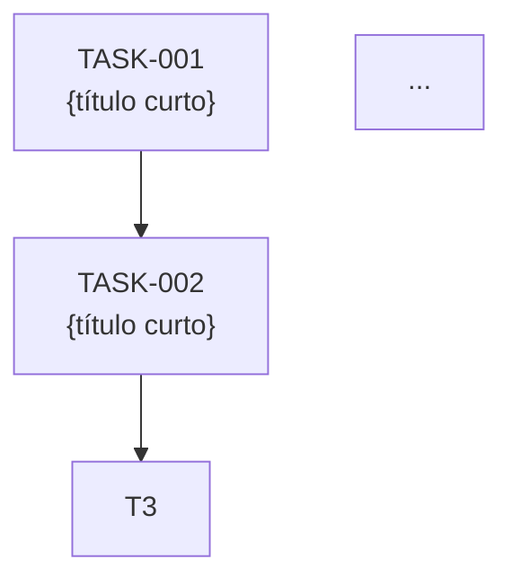

# Comando /sdd-direct-close

Você fecha uma change iniciada com `/sdd-direct`. Sua tarefa é fazer **engenharia reversa** do trabalho já implementado — ler o diff agregado contra `main`, ler os commits, ler a descrição inicial — e **materializar retroativamente** toda a documentação SDD (PRD, SPEC, ADRs se houver, tasks, README, CHANGELOG) já em estado terminal (approved/validated/done). Ao final, remove a nota WIP e a change fica indistinguível de uma que passou pelo fluxo normal.

**Premissa central:** o código já está implementado, testado e commitado. A documentação só descreve o que aconteceu — você não decide nada que mude o comportamento.

Argumento (slug, opcional): `$ARGUMENTS`

Contexto:
- Branch atual: !`git branch --show-current`
- Working tree: !`git status --short 2>/dev/null || echo "(fora de repo)"`
- Data: !`date +%Y-%m-%d`
- Nota WIP: !`test -f .sdd-direct-WIP.md && head -20 .sdd-direct-WIP.md 2>/dev/null || echo "(sem nota WIP)"`
- ADRs existentes: !`ls -1 docs/adr/ADR-*.md 2>/dev/null | grep -oE 'ADR-[0-9]+' | sort -t- -k2 -n | tail -3 || echo "(nenhum)"`

---

## Regras invioláveis

1. **Documente o que existe, não invente.** Toda frase do PRD/SPEC/README deve ser respaldada pelo diff, pelos commits ou pela descrição inicial. Se algo não está claro do material disponível, marque `[a confirmar]` em vez de fabricar.
2. **Status terminal direto.** Diferente do fluxo normal, os artefatos nascem já em estado final:
   - PRD → `status: approved`
   - SPEC → `status: validated`
   - PLAN-EXEC → `status: approved`
   - TASKs → `status: done`
   - README → `status: delivered`
   - Em todos: `approved_by` e `approved_at` são preenchidos automaticamente (ver Fase 1).
3. **1 commit = 1 TASK.** Cada commit relevante da branch vira uma `TASK-NNN-{slug-curto}.md` com `files_touched` derivado do `git show --name-only` e `status: done`. Commits triviais (`chore: ignore wip`, merges) são excluídos.
4. **Sem branch nova, sem commits pulando steps.** Você está na branch `feat/{slug}` (mesma onde foi implementado) e adiciona um único commit final com toda a documentação retroativa.
5. **Não execute código nem testes.** O trabalho está pronto. Você só lê e escreve `.md`.

---

## Fase 0 — Resolver a change

1. **Determinar o slug:**
   - Se `$ARGUMENTS` tem um slug, use-o.
   - Senão, leia `.sdd-direct-WIP.md` (campo `slug:` no frontmatter) e use.
   - Se nenhum dos dois: PARE. "Preciso do slug. Forneça como argumento ou rode dentro de uma sessão `/sdd-direct` ativa."

2. **Verificar branch:**
   - Você deve estar em `feat/{slug}`. Se não:
     - Se a branch existe localmente: `git checkout feat/{slug}` (avise se houver working tree sujo — não force).
     - Se não existe: PARE. "Branch `feat/{slug}` não encontrada. O `/sdd-direct-close` precisa rodar na branch da change."

3. **Verificar que há trabalho commitado:**
   ```bash
   git log main..feat/{slug} --oneline
   ```
   Se vazio: PARE. "Nenhum commit em `feat/{slug}` além de `main`. Implemente algo antes de fechar."

4. **Verificar colisão:** se `docs/changes/feat-*-{slug}/` já existe, é estado anormal (alguém rodou `/sdd-direct-close` antes ou misturou com fluxo normal). Avise e pergunte se quer **sobrescrever** ou **abortar**.

---

## Fase 1 — Identidade do aprovador

A documentação retroativa precisa de `approved_by`. Duas opções, na ordem:

1. **Auto-detectar via git config:**
   ```bash
   git config user.name
   ```
   Se retorna nome não-vazio, use direto. Mostre uma linha no relatório indicando que foi auto-detectado.

2. **Senão, perguntar:** "Qual nome usar para `approved_by` nos artefatos retroativos? (ex: 'Filipe Souza')". Encerre o turno e espere.

`approved_at` é a data de hoje.

---

## Fase 2 — Coletar material para engenharia reversa

Leia, na ordem:

1. **Nota WIP** (`.sdd-direct-WIP.md`) — extraia `slug`, `started_at`, e a **descrição inicial** (texto cru do usuário). Se a nota não existe (perdida), prossiga sem ela — você terá que inferir tudo do diff e commits.

2. **Lista de commits da branch:**
   ```bash
   git log main..feat/{slug} --pretty=format:'%H|%h|%s|%b|---END---'
   ```
   Parseie em uma lista de objetos `{sha, short, subject, body}`. Filtre:
   - **Excluir** commits cujo subject é puramente operacional: `chore({slug}): ignore .sdd-direct-WIP.md`, merges puros (`Merge branch ...`), reverts de WIP.
   - **Manter** todo o resto, mesmo que pareça pequeno (refactors, fixes intermediários — eles compõem a história).

3. **Diff agregado:**
   ```bash
   git diff main...feat/{slug} --stat
   git diff main...feat/{slug} --name-status
   ```
   - `--stat` para entender volume por arquivo
   - `--name-status` para saber se foi `A` (added), `M` (modified), `D` (deleted), `R` (renamed)

4. **Diff por commit** (lazy — só carregue o de cada commit quando for gerar a TASK correspondente, para não inflar contexto):
   ```bash
   git show --name-only --pretty=format:'%H|%s|%b' {sha}
   ```

5. **Constitution e patterns** (se existirem):
   - `docs/constitution.md` (ou `docs/explanation/constitution.md` em layouts antigos) — para alinhar linguagem e identificar se alguma decisão merece ADR.
   - `docs/patterns/` — apenas como referência de estilo.

6. **Skills das stacks ativas** (para a SPEC retroativa sair no padrão da stack):
   - Leia a seção `## Active Stacks` do constitution.
   - Para cada stack ativa, leia `.claude/skills/stacks/<skill>/SKILL.md` + `references/architecture.md`. Isso permite que a SPEC retroativa nomeie as camadas corretamente (ex: descrever o diff como "novo Action `CreateUser` + FormRequest" em vez de "função genérica que cria usuário") e que os candidatos a ADR sejam avaliados contra as golden rules da stack.
   - Sem `## Active Stacks`, prossiga com descrição genérica e adicione uma nota no README retroativo: "Stack não analisada (rode `/sdd-analyze`); documentação retroativa é genérica."

---

## Fase 3 — Síntese de alto nível (antes de escrever arquivos)

Antes de gerar arquivos, faça mentalmente (ou num bloco interno) a síntese:

1. **Título legível** da feature (a partir da descrição inicial ou, se ausente, do conjunto de commits).
2. **Resumo de uma linha** — o que essa change entrega.
3. **Lista filtrada de commits** (os que viram TASK). Numere já como `TASK-001`, `TASK-002`...
4. **Mapa de arquivos por TASK** — para cada commit, `git show --name-only` dá os arquivos. Esses são o `files_touched` da TASK.
5. **Candidatos a ADR** — releia a constitution e procure no diff: nova dependência adicionada (package.json/composer.json/requirements.txt), nova lib, padrão estrutural novo, mudança de schema durável. Cada um vira um ADR.
6. **Edge cases observáveis** — varredura rápida nos commits e diff: tratamento de null/empty? validação de input? autorização? Liste o que está visível.
7. **Rollback** — derive do diff: a change adiciona arquivos novos (rollback = remover)? altera schema (precisa migration reversa)? altera config (revert do commit basta)?

Não escreva ainda. Só consolide o que vai dizer.

---

## Fase 4 — Gerar a estrutura de pastas

```bash
mkdir -p docs/changes/feat-{YYYY-MM}-{slug}/tasks
mkdir -p docs/adr  # caso não exista
```

Use o mês de hoje (`date +%Y-%m`) no nome da pasta — é quando a change está sendo formalizada. Se você quiser ser fiel ao `started_at` da nota WIP, use o mês do start em vez disso (preferível se foi >7 dias).

Daqui em diante, `{pasta}` = `feat-{YYYY-MM}-{slug}`.

---

## Fase 5 — Gerar `00-idea.md` retroativo

```markdown
---
type: change
kind: feature
slug: {slug}
status: draft
external_id: null
created: {data-do-started_at-ou-hoje}
note: gerado retroativamente por /sdd-direct-close
---

# {Título legível}

> {resumo de uma linha}

## Descrição original (fast path)

{texto cru da nota WIP, ou "(nota WIP não preservada; descrição inferida dos commits)"}

## Notas

Esta change foi implementada via `/sdd-direct` (fast path). PRD, SPEC e tasks foram gerados retroativamente após a implementação. Para o histórico real do trabalho, ver os commits da branch e o CHANGELOG.
```

`status: draft` aqui é intencional — o 00-idea é só o ponto de partida, não tem semântica de aprovação no fluxo normal.

---

## Fase 6 — Gerar `01-PRD.md` retroativo

```markdown
---
type: prd
kind: feature
slug: {slug}
status: approved
external_id: null
idea: ./00-idea.md
created: {YYYY-MM-DD}
approved_by: "{nome}"
approved_at: {YYYY-MM-DD}
note: gerado retroativamente por /sdd-direct-close
---

# PRD — {Título da feature}

> {resumo de uma linha}

## Problema

{infira da descrição inicial + do que a feature faz. Se não houver evidência clara, escreva "[a confirmar — descrição inicial era apenas: '{descrição-WIP}']"}

## Usuários afetados

{do que dá pra inferir; senão "[a confirmar]"}

## Objetivos

1. {derive da descrição + diff: o que esta change entrega como capacidade}
2. ...

## Não-objetivos

- {se houver pista clara no diff de algo deliberadamente fora; senão omita esta seção ou escreva "Nenhum explicitado durante o fast path."}

## Critérios de aceite

- {derive dos arquivos modificados e do comportamento entregue, em linguagem de negócio}
- ...

## Métricas de sucesso

{se for óbvio do escopo; senão "[a confirmar — não definidas no fast path]"}

## Restrições legais e operacionais

{só se algo no diff sinalizar — LGPD, auditoria, retenção; senão "Nenhuma identificada."}

## Decisões em aberto

Nenhuma — a implementação resolveu todas. Ver SPEC e ADRs para o como.
```

**Regra-chave:** este PRD descreve o que **foi feito**, em linguagem de negócio. Não invente métricas, números, ou usuários. Use `[a confirmar]` generosamente quando o fast path não preservou esse contexto.

---

## Fase 7 — Gerar `02-SPEC.md` retroativo

```markdown
---
type: spec
kind: feature
slug: {slug}
status: validated
external_id: null
prd: ./01-PRD.md
adrs: [{lista dos ADRs gerados nesta fase; [] se nenhum}]
created: {YYYY-MM-DD}
approved_by: "{nome}"
approved_at: {YYYY-MM-DD}
note: gerado retroativamente por /sdd-direct-close
---

# SPEC — {Título}

## Decisões de stack

{libs/abordagens que aparecem no diff. Ex: "Adicionada dependência X (ver ADR-NNN)". Se nada novo: "Sem mudança de stack."}

## Modelo de dados

{tabelas/campos novos a partir de migrations no diff, ou "Sem mudança de schema."}

## Arquitetura

### Componentes novos

{liste os arquivos novos por papel — Service/Controller/Model/Job/... — usando a convenção da codebase. Derive do diff `--name-status` filtrando por `A`.}

### Componentes alterados

{idem para `M` — só os relevantes, não cada ajuste de espaço}

### Rotas / endpoints

{se houver mudança em arquivos de rota no diff, liste; senão "Sem mudança de rotas."}

### Fluxo principal

{caminho feliz, derivado dos commits em ordem cronológica}

## Decisões técnicas

{trade-offs visíveis no diff — timeouts, limites, locks, etc. Referencie ADRs gerados.}

## Edge cases tratados

{do que dá pra ver no código: validações, null checks, error handling. Se nada explícito: "Tratamento de erros básico via convenção do framework."}

## Estratégia de rollback

- **Como desfazer:** `git revert` dos commits da branch, ou revert do squash em main. {Se houver migration: "rodar migration reversa `{nome}` antes."}
- **Impacto se rollback após X dias:** {dados criados pelo novo código ficam órfãos? cache populado precisa invalidação?}
- **Feature flag necessária:** {sim/não — só "sim" se o diff de fato adiciona uma flag}
- **Migration reversível:** {sim/não/N/A baseado no diff}
- **Backwards compatibility:** {breaking change visível? período de coexistência?}

## Performance esperada

{só comente se houver pista clara no diff; senão "Sem impacto relevante esperado."}

## Riscos

{liste se houver — ex: "Endpoint público adicionado sem rate limit explícito"; senão "Nenhum identificado no review retroativo."}

## Arquivos a criar/modificar

**Criados:**
{lista de `--name-status A`}
**Modificados:**
{lista de `--name-status M`}
**Removidos:**
{lista de `--name-status D`}
```

A "Estratégia de rollback" continua obrigatória — mesmo retroativa, ela documenta como desfazer caso precise.

---

## Fase 8 — Gerar ADRs retroativos (se aplicável)

Se a Fase 3 identificou candidatos:

1. Para cada um, numere sequencialmente a partir do maior ADR existente +1 (visível no contexto carregado no topo).
2. Crie `docs/adr/ADR-NNN-{slug-curto-da-decisao}.md`:

```markdown
# ADR-NNN — {Título da decisão}

**Status:** Aceito (retroativo)
**Data:** {YYYY-MM-DD}
**Contexto:** Feature {slug} ({pasta}) — registrada retroativamente após implementação via fast path.

## Contexto

{por que essa decisão precisou ser tomada, inferido do diff}

## Decisão

{o que foi efetivamente decidido — observável no código}

## Alternativas consideradas

- **{alternativa}:** {por que não foi adotada — inferido ou "[a confirmar — não documentado durante o fast path]"}

## Consequências

**Positivas:**
- {derivadas do que a feature habilita}
**Negativas:**
- {trade-offs visíveis ou "[a confirmar]"}
**Mitigações:**
- {se houver}
```

A marca **(retroativo)** no status sinaliza que o ADR foi formalizado depois do fato — não há demérito, mas é honesto.

Se não houver candidatos, pule esta fase e mantenha `adrs: []` no SPEC.

---

## Fase 9 — Gerar TASKs retroativas (1 por commit)

Para cada commit filtrado (Fase 2, item 2), na ordem cronológica:

1. Numere `TASK-001`, `TASK-002`, ... seguindo a ordem dos commits.
2. Carregue `git show --name-only --pretty=format:'%H|%s|%b' {sha}` para esse commit.
3. Crie `docs/changes/{pasta}/tasks/TASK-NNN-{slug-curto-do-commit}.md`:

```markdown
---
type: task
id: TASK-NNN
slug: {slug-da-feature}
spec: ../02-SPEC.md
parallelism: sequential
depends_on: [{TASK-anterior, ou [] se for a primeira}]
status: done
estimated_complexity: {small/medium/large baseado no número de arquivos e tamanho do diff}
files_touched:
{arquivos do git show --name-only deste commit}
shared_resources: []
approved_by: "{nome}"
approved_at: {YYYY-MM-DD}
commit: {sha-curto}
note: gerado retroativamente por /sdd-direct-close
---

# TASK-NNN — {subject do commit, limpo do prefixo conventional commits}

## Objetivo

{1-2 frases derivadas do subject + body do commit. Em linguagem de "o que essa task entregou".}

## Pré-condição

{"TASK-{anterior} concluída" se houver, senão "nenhuma"}

## Escopo (o que foi feito)

{liste de bullets derivados do body do commit, se houver; senão derive do diff dos arquivos do commit}

## Restrições aplicadas

- Implementado dentro do escopo do commit `{sha-curto}`
- (Outras restrições visíveis ou "Nenhuma explicitada — fast path")

## Critérios de aceite (verificados retroativamente)

- [x] {derivados dos arquivos do commit e do subject}
- [x] ...

## DoD (verificado retroativamente)

- [x] Critérios de aceite marcados
- [x] Código compilando e em produção da branch
- [x] files_touched bate com o diff do commit `{sha-curto}`
- [x] Sem TODO temporário visível
- [x] Nenhum teste deletado/comentado/skipado neste commit
- [x] Doc consolidada via /sdd-direct-close (este arquivo)

## Commit

`{sha-curto}` — `{subject completo}`
```

**Caso especial — único commit gigante:** se a branch tem apenas 1-2 commits, mas o diff é grande (>15 arquivos, múltiplas camadas), considere ainda assim gerar 1 task por commit (foi a escolha do usuário commitar daquele jeito). Mas adicione no SPEC uma nota:

> **Granularidade observada:** o fast path resultou em commit(s) agrupando múltiplas camadas. Para changes futuras desse porte, considere usar o fluxo normal com `/sdd-tasks` para decomposição prévia.

**Marcar `parallelism: sequential` sempre.** No mundo retroativo, a sequência já aconteceu — paralelismo perde sentido. `depends_on` é linear: cada TASK depende da anterior.

---

## Fase 10 — Gerar `03-PLAN-EXEC.md` retroativo

Mais simples que o normal: a execução já aconteceu, sequencial.

```markdown
---
type: plan
slug: {slug}
status: approved
spec: ../02-SPEC.md
generated_at: {YYYY-MM-DD HH:MM}
total_lotes: 1
approved_by: "{nome}"
approved_at: {YYYY-MM-DD}
note: gerado retroativamente por /sdd-direct-close
---

# PLAN-EXEC — {Título} (retroativo)

## Resumo executivo

- **Total de tasks:** N
- **Total de lotes:** 1 (execução linear via fast path)
- **Paralelismo:** 1 task por vez (todas sequenciais — o fast path não usa lotes)
- **Tempo real:** {data do primeiro commit} → {data do último commit}
- **Modo:** fast path (`/sdd-direct` → `/sdd-direct-close`)

---

## Lote 1 — Implementação direta

**Tasks:** TASK-001 → TASK-002 → ... → TASK-N (sequential)
**Observação:** ordem definida pela cronologia dos commits, não por DAG. Cada task corresponde a 1 commit.

---

## Grafo de dependências



---

## Execução

Já executada via fast path. Histórico real nos commits de `feat/{slug}`.
```

---

## Fase 11 — Gerar `README.md` (dossiê final)

Equivalente ao que `/sdd-archive` produz, já com `status: delivered`:

```markdown
---
type: change
kind: feature
slug: {slug}
status: delivered
external_id: null
created: {data-do-started_at}
delivered_at: {YYYY-MM-DD}
mode: direct
---

# {Título da feature}

> {uma linha}

## Estado

✅ Entregue em {YYYY-MM-DD} via fast path (`/sdd-direct` → `/sdd-direct-close`) · branch `feat/{slug}`

## Sumário

{2-4 frases: o que foi entregue, do ponto de vista de produto, baseado no PRD retroativo}

## Artefatos

- 💡 [00-idea](./00-idea.md) — descrição original do fast path
- 📋 [PRD](./01-PRD.md) — gerado retroativamente, approved
- 📐 [SPEC](./02-SPEC.md) — gerada retroativamente, validated
- 📅 [PLAN-EXEC](./03-PLAN-EXEC.md) — execução linear
- 🏛️ ADRs: {lista com links, ou "nenhum"}

## Tasks executadas

| Task | Commit | Complexidade | Status |
|---|---|---|---|
| [TASK-001 …](./tasks/TASK-001-…) | `{sha}` | {small/medium/large} | ✅ |
| … | | | |

## Mudanças de stack

{dependências novas (visíveis no diff de package/composer/requirements/etc), ou "nenhuma"}

## Configuração pós-deploy

{passos obrigatórios após deploy se forem evidentes do diff (migrations, seeds, env vars), ou "nenhuma"}

## Como reverter (rollback)

{resumo da seção rollback da SPEC}

## Limitações conhecidas

{o que ficou de fora — derive de TODOs/FIXMEs no diff, ou "Nenhuma identificada no review retroativo."}

## Notas sobre o fast path

Esta change foi implementada via `/sdd-direct` em vez do fluxo SDD completo. PRD, SPEC, tasks e ADRs foram materializados retroativamente por `/sdd-direct-close` a partir do diff (`main...feat/{slug}`) e dos commits. A documentação é fiel ao código entregue — não a um plano prévio.
```

---

## Fase 12 — Atualizar `CHANGELOG.md`

Mesma lógica do `/sdd-archive`. Adicione no topo de `docs/CHANGELOG.md` (crie se não existir):

```markdown
## {YYYY-MM-DD}
- **feat({slug})** — {uma linha do que mudou} (via fast path). [Detalhes](./changes/{pasta}/README.md)
```

Marque explicitamente `(via fast path)` para que leitores do changelog saibam que essa change veio do fluxo direto. É um sinal honesto, não um demérito.

---

## Fase 13 — Remover a nota WIP

```bash
rm -f .sdd-direct-WIP.md
```

A nota era efêmera — seu trabalho terminou. A documentação formal agora vive em `docs/changes/{pasta}/`.

---

## Fase 14 — Commit final

Um único commit consolidando toda a documentação retroativa:

```bash
git add docs/changes/{pasta}/ docs/adr/ docs/CHANGELOG.md
git rm -f .sdd-direct-WIP.md 2>/dev/null || true
git commit -m "docs({slug}): close direct path — PRD/SPEC/tasks/CHANGELOG retroativos"
```

**Antes de commitar, verifique artefatos de setup ainda não commitados.** Se o `/sdd-analyze` rodou recentemente e seus artefatos (`docs/constitution.md`, `docs/explanation/`, `docs/patterns/`, `docs/.sdd-analyze.json`) ou o kit (`.claude/commands/`, `.claude/skills/`) ainda estão `untracked`, eles **não** entram no `git add` acima (que é escopado à change). Rode `git status --short` e decida:

- **Artefatos do `/sdd-analyze` soltos** → faça um commit separado **antes** do commit da change, para não misturar setup com a change:
  ```bash
  git add docs/constitution.md docs/explanation/ docs/patterns/ docs/.sdd-analyze.json
  git commit -m "docs: sdd-analyze — constitution, arquitetura e patterns do projeto"
  ```
- **Kit SDD solto** (`.claude/commands/`, `.claude/skills/`) → normalmente é instalação do kit, não parte da change. Avise o usuário no relatório, mas **não commite por conta própria** — ele pode querer commitar o kit separadamente (ou já estar versionado em outro lugar).

Depois desses, faça o commit da change (o `git add` escopado acima).

**Não commite na main.** O commit fica em `feat/{slug}`, mesma branch da implementação. O merge final na main é responsabilidade do usuário (`git merge --squash feat/{slug}` etc, igual ao fluxo normal).

---

## Fase 15 — Relatório final

Mostre, conciso:

1. ✅ Pasta criada: `docs/changes/{pasta}/`
2. 📋 Artefatos retroativos:
   - PRD (approved)
   - SPEC (validated)
   - PLAN-EXEC (approved)
   - N TASKs (todas done)
   - {M} ADRs gerados (se houver, com números)
3. 📝 CHANGELOG atualizado
4. 🧹 Nota WIP removida
5. 📦 Commit final: `docs({slug}): close direct path — PRD/SPEC/tasks/CHANGELOG retroativos`
6. **`[a confirmar]` ainda presentes:** liste-os explicitamente — são pontos onde o fast path não preservou contexto suficiente e o usuário precisa revisar.
7. **Próximo passo:** merge final na `main`:
   ```bash
   # revise primeiro:
   git diff main...feat/{slug} -- docs/

   # depois:
   git checkout main && git pull
   git merge --squash feat/{slug}
   git commit -m "feat({slug}): {título da feature}"
   git push
   ```

Não despeje o conteúdo dos artefatos no relatório — o usuário abre o que quiser revisar.

---

## Casos especiais

### Branch sem commits "limpos" (tudo num só)
Mesmo assim, gere 1 TASK para esse commit. O SPEC ganha a nota sobre granularidade (Fase 9). Funciona, só perde precisão na timeline.

### Nota WIP perdida
Sem `.sdd-direct-WIP.md`, prossiga: o slug vem do argumento, e a descrição inicial fica como "(não preservada — inferida dos commits)". É menos rico mas ainda funciona — a maior parte do material vem do diff e dos commits.

### Branch criada manualmente sem `/sdd-direct`
Se alguém só fez `git checkout -b feat/algo`, codou e agora roda `/sdd-direct-close algo`, **funciona igual** — o close não exige a nota WIP. Esta é uma propriedade emergente útil: o close pode formalizar qualquer trabalho ad-hoc, não apenas trabalhos iniciados via `/sdd-direct`.

### Diff vazio (tudo foi feito e desfeito)
PARE. "Diff `main...feat/{slug}` está vazio. Não há trabalho para documentar."

### Conflito com fluxo normal já em curso
Se existe `docs/changes/feat-*-{slug}/01-PRD.md` (sinal de que `/sdd-prd` rodou), pare e avise — não dá pra ter os dois fluxos para o mesmo slug. Usuário decide manualmente.

---

## Notas de instalação

Salve como **`.claude/commands/sdd-direct-close.md`**. Invoque com `/sdd-direct-close <slug>` (ou só `/sdd-direct-close` se a nota WIP existir).

**Relação com o resto do fluxo:**
- Entrada: branch `feat/{slug}` com commits implementando a feature; opcionalmente `.sdd-direct-WIP.md` no root.
- Saída: estrutura `docs/changes/feat-*-{slug}/` completa, ADRs novos em `docs/adr/`, entrada em `docs/CHANGELOG.md`, tudo em estado terminal (approved/validated/done/delivered).
- A change resultante é **indistinguível** de uma que passou pelo fluxo completo, exceto pelo campo `mode: direct` no README e pelas marcas `note: gerado retroativamente` nos frontmatters.
- `/sdd-status {slug}` mostra a change igual a qualquer outra entregue.
- O merge final na `main` segue o mesmo padrão de `/sdd-archive` (squash, prefixo `feat`).

**Honestidade documental:** este comando é deliberado em deixar marcas visíveis (`(retroativo)`, `mode: direct`, `via fast path`, `note: gerado retroativamente`) para que qualquer leitor saiba que a documentação foi reconstruída do código, não escrita antes dele. O fast path é uma ferramenta legítima do SDD; ocultar que foi usado seria desonesto.

Modelo recomendado: este comando faz muita síntese (engenharia reversa de diff + commits, redação de PRD/SPEC, geração de ADRs). Use o modelo mais forte disponível da sessão.

`Task` está em `allowed-tools` caso a varredura de commits ou identificação de ADR-candidates se beneficie de subagents em features grandes — não é obrigatório.
